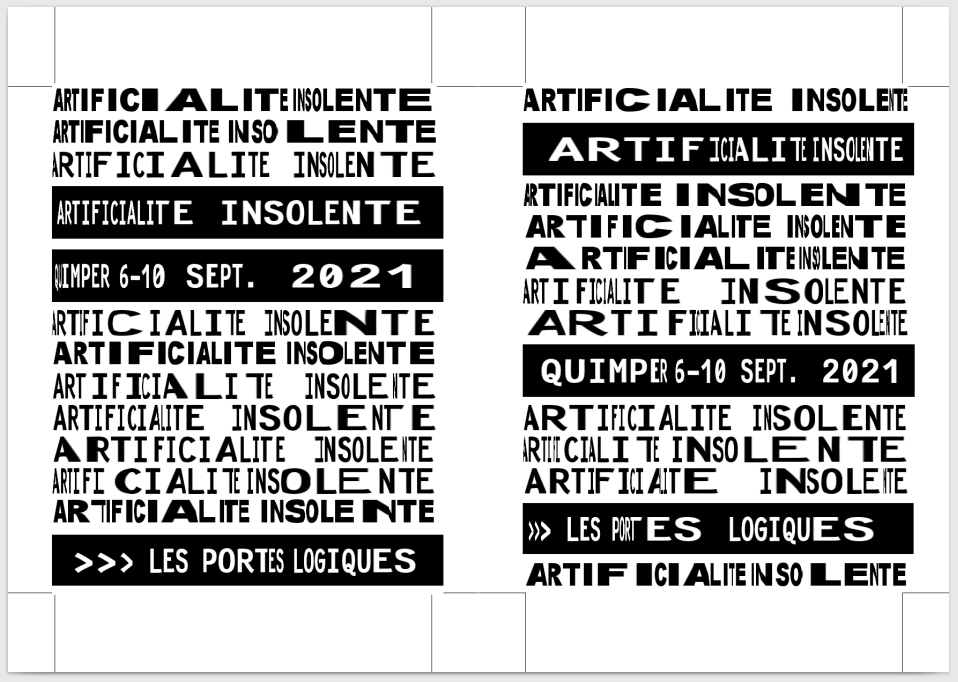

# Artificialité insolente

Gif animé et flyers réalisés par des scripts processing

## anim

Lancer le script processing qui crée 16 images  
Puis
```
# 20210903 / ImageMagick 6.9.7-4 Q16 x86_64 20170114 / Debian Stretch 9.5 @ Kirin
convert -delay 200 -loop 0 anim_ai_*.png anim.gif
convert -dispose 2 anim.gif -fuzz 50% -transparent white anim_artificialite_insolente.gif
```

Pour obtenir


## flyer

Lancer le script php en indiquant le nombre de pages (2 flyers par exemplaire..)
```
# 20210903 / PHP 7.0.33-0+deb9u11 (cli) / Debian Stretch 9.5 @ Kirin
php ./fly_ai_creation_exemplaires.php --exemplaires=1
```

Imprimer avec les paramètres suivants :
* paysage
* bord court
* ajuster selon la zone imprimable

